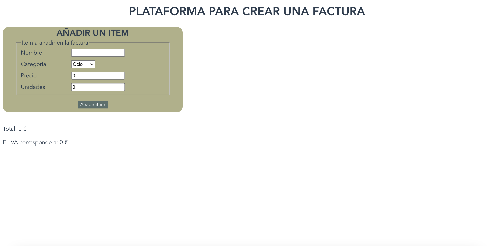
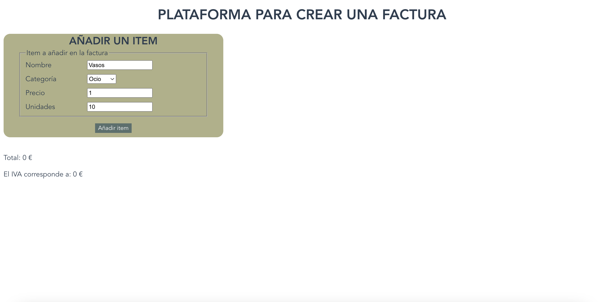
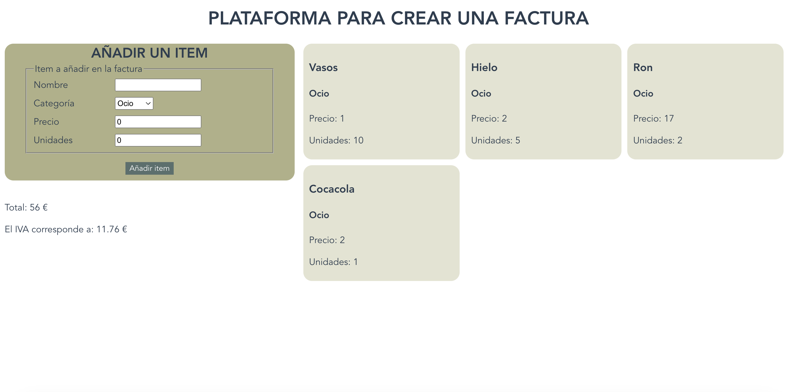

# teacher-management

## Project info
Me adentro un poco más en Vue. En este proyecto me centraré en la comunicación vertical entre componentes y en los datos computados.

El proyecto consiste en crear una plataforma donde podrás añadir items a tu factura para ver el precio total y cuánto IVA le corresponde.

## Project review
Galería de fotos del componente:

- Vista inicial de la plataforma


- Escribiedo datos de un item


- Items añadidos y factura final


## Project setup
```
npm install
```

### Compiles and hot-reloads for development
```
npm run serve
```

### Compiles and minifies for production
```
npm run build
```

### Lints and fixes files
```
npm run lint
```
